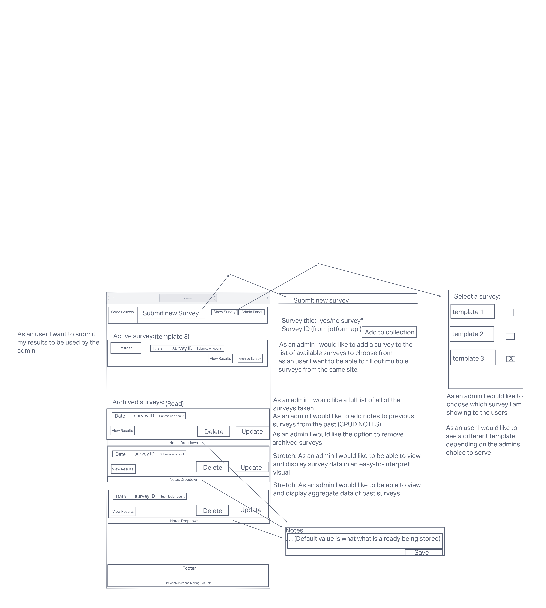

# Contributors Tech Prospective Survey - Frontend

VISION

## Minimum Viable Product (MVP) Definition

### Authors: Nicholas Mercado, Brian Thornburg, Tanner Percival, Matt Rangel

----------

### Links and Resources

- 
- 
- [User Stories](https://github.com/orgs/the-power-coders/projects/2)
- [Public Docs](https://github.com/the-power-coders/Docs)
- [Mozilla MDN Web Docs](https://developer.mozilla.org/en-US/docs/Web/JavaScript)

### **Reflections and Comments**

### Afternoon Standup Monday, March 7, 2022

Tasks for Tuesday

- [ ] Notes functionality
- [ ] Add Values to Properties to Schemas(TEAM)
- [ ] Create Notes Functionality (Tanner and Brian)
- [ ] Get Surveys (Nic and Matt)
  - [ ] Confirm matching email
  - [ ] Adjust the auth0
  - [ ] Adjust the server
- [ ] Delete Past Surveys(Nic and Matt)
  - [ ] Capture subdomain
- [ ] Delete Button (Nic and Matt)
- [ ] Creating a new Survey(Brian)
- [ ] Modify access to only the subdomain (Nic and Matt)
  - [ ] Add to Surveys
- [ ] New Schema and Table(Tanner and Brian)
  - [ ] Created surveys table
- [ ] Add email Schema(Team)

### Morning Standup Tuesday, March 8, 2022

Tanner and Brian will be pairing up and executing tasks above

Matt and Nic will be pairing up and executing tasks

Tanner: Add the ability to add surveys. A new schema for notes will be needed at some point. Tasks as driver and/or navigator.

Nicholas: Today Matt and I will be tackling sorting the incoming surveys by subdomain. By then, we should be complete with most user stories.
Found a blocker, hit the database with a subdomain.
Fun to figure that out.
Then, work on the delete functionality. Good day ahead of us.

Brian: Paid up with Tanner, excited to start coding. Learn the inner workings of this code a bit better. Not all worked out in head but confident it will come once I put my hands on it.

Matt: I am super excited and anxious at the same time. Really want to get my hands on some code especially that delete as struggled on the assessment. I feel tired and rested at the same time.

*Reminder, this project is a learning experience and not just another task to complete.*

### Evening Wind Down Tuesday, March 8, 2022

Matt and Nic:

- [ ] Completed sort function using the Auth0 props to the all get methods.
- [ ] Created a subdomain function to filter email address by their subdomain.
- [ ] Added that to where it was required.
Added logout button to header.

Tanner and Brian:

- [ ] Added post route.

### Morning Standup Tuesday, March 9, 2022

- [ ] Create survey unique. Need to make a post request that contains the admins input and add that to the database.
  It will change the active survey.
- [ ] Drop down, active survey box, that will bea ble to edit notes and delete surveys. Cleans up the interface. Edit ability will be on the notes.
- [ ] Delete button, Will need be an update route, you can create or remove.

Generale notes and ToDos:

Click on drop down, a list of active surveys. SHow surveys, that what the dropdown is populating. Templates, are survey ids.

Editing the data of active survey shall be in the.

In active survey handle notes. Only for note Crud.

Notes will be added in the accordion for archived survey.
If there is time add notes to active survey.

Delete will be in the archived survey in the accordion.

Questions to be yes or no or true and false.

Get Brooks `jotform` auth and ask if we can change the chart to be more digestible.  

We can add second screen to show aggregated data.

Brian: Pointed out 'chart.js' and what was in it for us to look at and see how we can improve it. NICE FIND!

Matt: Thought that occurred to me, I really need to solidify

Tanner: Blockers out of the way, tasks for the day is pretty light. Tanner will be navigating again. Suggesting to break up notes. Stretch for tomorrow Thursday

Nic: Wanted to get aligned again with what the plan was and see it on a drawing.

Reminder: About me.
